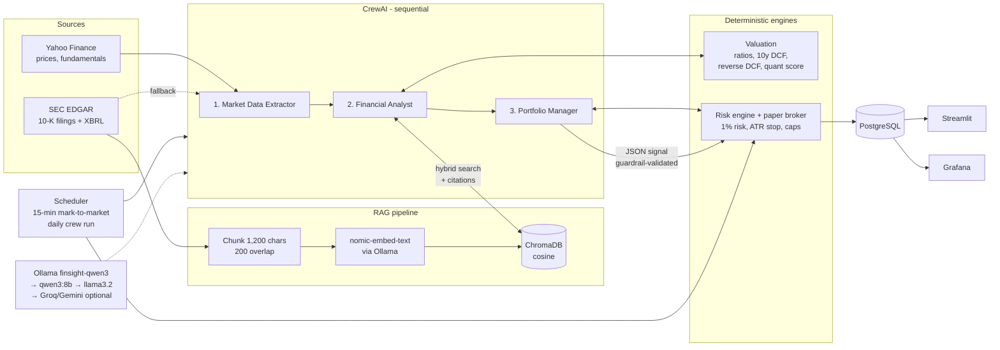

# FinSight Crew — Autonomous Financial Research & Algo Paper-Trading

**Course:** Agentic AI for Business Automation (AAIBA) · PGDM-BDA · Term 04, 2026-27
**Topic 1:** Autonomous Financial Research & Algo-Paper-Trading Crew

| Roll no. | Name |
|---|---|
| 341273 | Shiva Aggarwal |
| 341283 | Shubhi Jain |
| 341279 | Sarthak Aggarwal |
| 341270 | Nitin Deswal |
| 341294 | Vineet Intodia |
| 65089 | Mahaveer Soni |

A three-agent CrewAI system that researches **US and Indian** stocks from live market data **and the companies' own SEC 10-K filings (RAG)**, values them with a DCF and multiples, and turns the research into risk-managed **paper trades**, running continuously on a scheduler. Everything runs locally and for free: **Ollama (Qwen3 8B)** as the LLM, **ChromaDB** as the vector store, **PostgreSQL** for state, **Streamlit** as the control room and **Grafana** for monitoring.

> Paper trading only. Nothing here is investment advice.

---

## Two markets, one switch

| | 🇺🇸 US (`MARKET=US`) | 🇮🇳 India (`MARKET=IN`) |
|---|---|---|
| Watchlist | AAPL, MSFT, NVDA, JPM, XOM, JNJ | WIPRO, ITC, SUNPHARMA, EICHERMOT, BHARTIARTL, ASIANPAINT (NSE) |
| RAG corpus | SEC 10-K (Business, Risk Factors, MD&A) via `edgartools` | FY2025-26 annual-report PDFs from each company's own website (`scripts/fetch_annual_reports.py`), narrative pages labelled Business & Strategy / Risk Management / MD&A |
| Citation | `[AAPL 10-K FY2025 · Risk Factors · #21]` | `[ITC.NS AR FY2026 · MD&A · p67 #93]` (links to the PDF page) |
| Benchmark | SPY | NIFTY 50 |
| Valuation inputs | 10y Treasury 4.3%, ERP 5.5%, terminal growth 2.5% | 10y G-sec 6.5%, ERP 7%, terminal growth 5% |
| Beta | vs SPY, 2y weekly | vs NIFTY 50, 2y weekly (Yahoo's beta for Indian stocks is vs the S&P 500) |
| Starting cash | $100,000 | ₹1,00,00,000 |
| Crew run | weekdays 16:30 New York | weekdays 16:00 IST |
| Streamlit | http://localhost:8502 | http://localhost:8503 |
| Database | `finsight` | `finsight_in` |

Switch markets with the sidebar button in Streamlit or the **Market** dropdown in Grafana. The six Indian companies were chosen because their data is clean: statements in rupees (HCL Tech reports in USD), positive free cash flow in each of the last three years, and a report downloadable from the company's own site (TCS and BSE block automated downloads, so they were not used).

## 1. Architecture



### Agents and tools

| Agent | Tools | Output |
|---|---|---|
| **Market Data Extractor** | `get_market_snapshot` (price, SMA50/200, RSI, ATR, returns, volatility, drawdown) · `get_fundamentals` (Yahoo → SEC XBRL fallback) | Data brief |
| **Financial Analyst** | `run_valuation` (P/E, EV/EBITDA, FCF yield, 3-scenario 10-year DCF, reverse DCF, value/quality/momentum score, risk flags) · `search_sec_filings` (**RAG**) · `get_past_decisions` (memory) | Analyst report with 10-K citations |
| **Portfolio Manager** | `get_portfolio_state` · `plan_position` (ATR stop, 2R target, 1%-risk sizing, caps) | Strict JSON signal: BUY/HOLD/SELL, confidence, stop-loss, take-profit, shares, rationale, risks, citations |

**The LLM never does arithmetic.** All numbers come from Python tools; the agents reason about them and explain.

---

## 2. RAG component

| Stage | Choice | Why |
|---|---|---|
| Corpus | Latest 10-K per company: Item 1 Business, Item 1A Risk Factors, Item 7 MD&A | Primary, audited source; qualitative evidence that price data lacks |
| Loader | [`edgartools`](https://edgartools.readthedocs.io/) (free, no API key) | Section-aware parsing of SEC filings |
| Chunking | Paragraph-aware, ~1,200 chars, 200-char overlap starting on a sentence boundary | Keeps facts that straddle a boundary retrievable |
| Embeddings | `nomic-embed-text` (Ollama), with `search_document:` / `search_query:` prefixes | Free, local, 8K context; prefixes are how the model was trained |
| Vector store | ChromaDB, persistent, cosine distance, metadata filter per ticker | Zero-ops, runs in-process |
| Retrieval | Top-25 by cosine → **hybrid re-rank** 0.75 × semantic + 0.25 × keyword overlap → top-k | Exact terms (drug names, laws, product names) matter in filings |
| Grounding | Every chunk carries a citation tag, e.g. `[NVDA 10-K FY2026 · Risk Factors · #69]`; the guardrail rejects a signal without citations | Auditable claims, no invented sources |

### Retrieval evaluation (`python eval/run_rag_eval.py`, `MARKET=IN python eval/run_rag_eval.py`)

18 hand-written questions over AAPL / NVDA / JNJ 10-Ks, deliberately **paraphrased so they do not contain the answer keyword** (e.g. "Which foundry manufactures NVIDIA's chips?" → must find "TSMC"). A hit = a retrieved chunk contains the ground-truth fact.

| Configuration | Hit@1 | Hit@3 | Hit@5 | MRR@5 |
|---|---|---|---|---|
| Vector only | 0.50 | 0.61 | 0.67 | 0.56 |
| **Hybrid re-rank (α = 0.75)** | **0.50** | **0.78** | **0.78** | **0.61** |
| Hybrid re-rank (α = 0.5) | 0.44 | 0.72 | 0.72 | 0.56 |

**India** (18 questions over the six annual-report PDFs; PDF text is noisier than SEC HTML):

| Configuration | Hit@1 | Hit@3 | Hit@5 | MRR@5 |
|---|---|---|---|---|
| First version (1,200-char chunks, no headers, α = 0.75) | 0.44 | 0.50 | 0.61 | 0.50 |
| + contextual chunk headers, vector only | 0.44 | 0.56 | 0.83 | 0.57 |
| **+ contextual chunk headers, hybrid α = 0.9** | **0.50** | **0.72** | **0.78** | **0.59** |

Contextual headers (company · report · section · page prepended to each chunk before embedding) and a per-market blend weight lifted India Hit@3 from 50% to 72%.

Hybrid re-ranking lifts US Hit@3 from 61% to 78%. The misses (e.g. "who builds Apple's hardware") are honest failures we discuss in the presentation.

---

## 3. Error recovery and autonomy

| Failure | Recovery | Where to see it |
|---|---|---|
| Primary LLM down / errors | Fallback chain `finsight-qwen3 → qwen3:8b → llama3.2 → Groq → Gemini` | `events.kind = llm_fallback` |
| Yahoo Finance fails | SEC EDGAR XBRL facts (freshest annual value across tags, nothing older than 18 months, incomplete filings rejected) → last cached copy (flagged stale) | `data_fallback` |
| Postgres down | Automatic SQLite fallback | sidebar "Database" |
| PM returns malformed JSON / skips its sizing tool / no citations | CrewAI **guardrail** rejects with a specific message; agent retries (max 3) | `guardrail_retry` |
| LLM proposes a wrong stop-loss or size | Deterministic risk engine overrides it | `risk_override` |
| PM's rationale contradicts the tool numbers (e.g. says "composite 72" when it is 55, "uptrend" in a downtrend) | Fact-check guardrail compares the rationale with the tool results and sends it back with the correct figures | `guardrail_retry` |
| PM cites a passage it never retrieved | Guardrail checks every citation against the passages actually returned by `search_sec_filings` in this run; invented tags are dropped, none valid → retry | `guardrail_retry` |
| Analyst cites a passage it never retrieved | Report citations are checked after the run and flagged `⚠️unverified` | `citation_unverified` |
| LLM misapplies the fund rules (e.g. BUY with composite < 70) | Deterministic policy check downgrades to HOLD | `risk_veto` (`policy:composite<70`) |
| Signal breaches risk limits / low confidence | Trade vetoed | `risk_veto` |
| Price hits stop / target between crew runs | Scheduler exits automatically every 15 min | `auto_exit` |
| A tool raises | Tool returns `{"error", "hint"}` so the agent continues and reports the gap | `error` |
| Process killed mid-run (restart, crash) | Run marked `interrupted` on next scheduler tick, so success rates stay truthful | `runs.status` |
| Two crew runs at once | One run per process (the local 8B model serves one request at a time anyway); the second gets a clear "busy" message | UI |

**Memory:** `get_past_decisions` gives the analyst the fund's previous signals and current position for the ticker, so decisions stay consistent across days or explicitly explain a change.

---

## 4. Strategy and risk rules

* **Valuation:** P/E, EV/EBITDA, FCF yield, ROE, leverage; 10-year two-stage DCF (bear / base / bull) using reported free cash flow and a CAPM cost of equity; **reverse DCF** giving the FCF growth the current price implies.
* **Quant score (0–100):** value 35% (DCF margin of safety, FCF yield, analyst upside) + quality 35% (ROE, net margin, leverage) + momentum 30% (12-month return, trend, RSI).
* **Decision rules:** BUY if the verdict is Attractive (composite ≥ 70) and the risk engine allows shares; SELL if held and Unattractive (or composite < 50); else HOLD.
* **Risk engine:** 1% of equity at risk per trade · stop = entry − 2 × ATR(14) · take-profit = 2R · ≤ 10% per position · ≤ 30% per sector · no positions smaller than 1% of equity · BUY needs confidence ≥ 0.55 · long-only.

### Backtest (`python scripts/run_backtest.py`)

The LLM and fundamentals cannot be backtested honestly (we only have *today's* fundamentals and 10-K — look-ahead bias), so the backtest validates the **momentum rules + risk engine** over the 6-stock watchlist.

| Jul 2022 – Sep 2026 | Total return | CAGR | Volatility | Sharpe | Max drawdown |
|---|---|---|---|---|---|
| Strategy | +27.6% | 6.0% | 5.1% | 0.32 | **−7.6%** |
| SPY buy & hold | +111.6% | 19.6% | 16.1% | 0.92 | −18.8% |
| Equal-weight buy & hold | +328.6% | 41.6% | 25.1% | 1.34 | −25.5% |

**India, same rules (NIFTY 50 benchmark):** strategy +23.3% (max drawdown −5.8%) vs NIFTY 50 +39.1% (−15.8%); Sharpe −0.33 because the 5.2% CAGR is below India's 6.5% risk-free rate.

US: 149 trades, 43% win rate, average win +10.0% vs average loss −4.8%, **average capital invested only 25.7%**. Reading: the risk engine does its job (a third of the market's volatility, less than half its drawdown), but the 1%-risk sizing leaves most capital idle, so it lags a strong bull market. That trade-off is a key discussion point.

---

## 5. Run it

**Prerequisites:** macOS/Linux, Docker Desktop, [Ollama](https://ollama.com), Python 3.11.

```bash
# 1. Models (≈5.5 GB)
ollama pull qwen3:8b
ollama pull nomic-embed-text
ollama create finsight-qwen3 -f Modelfile      # tuned temperature, 16K context, system prompt

# 2. Config
cp .env.example .env                            # optional: SEC_IDENTITY, cloud API keys

# 3. Full stack: Postgres + Streamlit + scheduler + Grafana
docker compose up -d --build
```

| Service | URL |
|---|---|
| Streamlit control room, US | http://localhost:8502 |
| Streamlit control room, India | http://localhost:8503 |
| Grafana (admin / finsight) | http://localhost:3001 |
| Postgres | localhost:5432 (finsight / finsight) |

**Local development without Docker:**

```bash
python3.11 -m venv .venv && source .venv/bin/activate
pip install -r requirements.txt
python scripts/run_crew.py AAPL           # one ticker, with paper trade
python scripts/run_crew.py --dry-run MSFT # analyse only
streamlit run app/streamlit_app.py        # http://localhost:8501
python -m finsight.scheduler --once       # one pass over the watchlist
python eval/run_rag_eval.py               # RAG evaluation
python scripts/run_backtest.py            # backtest
python scripts/reset_portfolio.py --yes   # clean slate before a demo
python scripts/fetch_annual_reports.py    # India: download + verify the 6 annual reports
MARKET=IN streamlit run app/streamlit_app.py   # any command runs in India mode with MARKET=IN
pip install pytest && pytest -q           # 28 offline tests: valuation, chunking, guardrail, risk engine, fallbacks
```

Ollama runs on the host rather than in Docker so it can use the Apple-silicon GPU (Metal); containers reach it through `host.docker.internal:11434`.

---

## 6. Repository layout

```
finsight/
  config.py          settings from .env
  llm.py             LLM fallback chain
  crew.py            agents, tasks, JSON guardrail
  pipeline.py        end-to-end run for one ticker
  markets.py         per-market settings (US / India)
  rag.py             10-K / annual-report ingestion, hybrid retrieval, grounded Q&A
  pdf_reports.py     section-aware text extraction from Indian annual-report PDFs
  report_bot.py      downloads + verifies the latest Indian annual reports
  broker.py          paper broker + risk engine
  backtest.py        rule-layer backtest
  scheduler.py       always-on jobs
  db.py              Postgres / SQLite persistence
  tools/
    market_data.py   Yahoo → SEC → cache
    valuation.py     ratios, DCF, reverse DCF, quant score
    crew_tools.py    CrewAI tool wrappers (logged, cached, never raise)
app/streamlit_app.py control room (5 tabs)
grafana/             provisioned datasource + dashboard
eval/                RAG eval set, results, backtest outputs
scripts/             CLI entry points
Modelfile            custom Ollama model
docker-compose.yml   Postgres, app, scheduler, Grafana
```

## 7. Rubric mapping

| Criterion | Evidence |
|---|---|
| Functional integration (40%) | Data → valuation → RAG research → decision → risk engine → paper fill → monitoring, end to end, on a scheduler |
| Agent autonomy & tool calling (35%) | 8 tools, enforced tool use, memory, guardrail retries, LLM / data / DB fallbacks, all logged to `events` |
| Strategic justification (25%) | Cited 10-K evidence, DCF + reverse DCF, transparent factor score, hard risk rules, honest backtest vs SPY |
| RAG (25%) | SEC 10-K corpus, overlap chunking, local embeddings, hybrid re-rank, citations enforced, quantitative retrieval evaluation |

## 8. Limitations

* Qwen3 8B on a laptop takes ~2 minutes per ticker; a cloud model (Groq) is faster but rate-limited.
* The DCF is deliberately conservative (cost of equity used as the discount rate), so the reverse DCF carries more weight in decisions.
* Yahoo Finance is unofficial and can change without notice; SEC fallback covers fundamentals, cache covers prices.
* The backtest covers the rules, not the agents (see §4).
